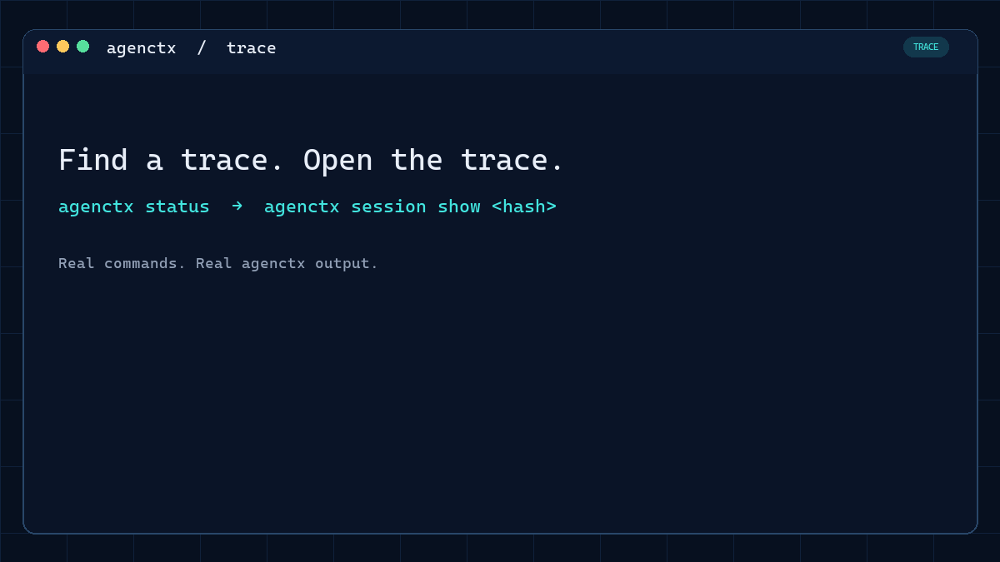
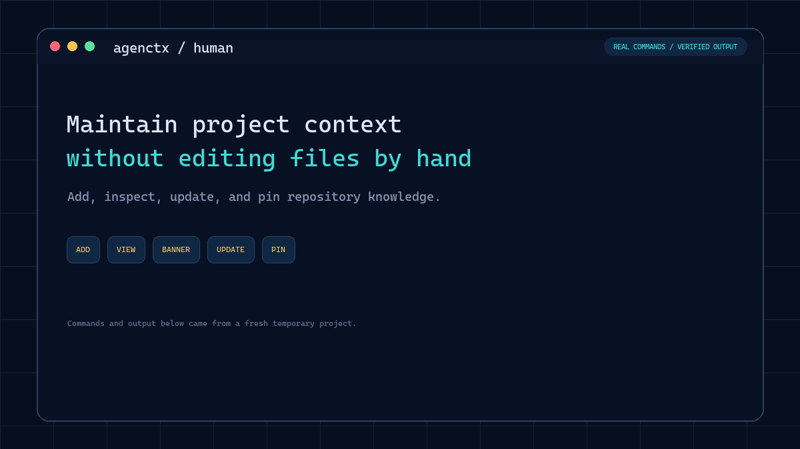
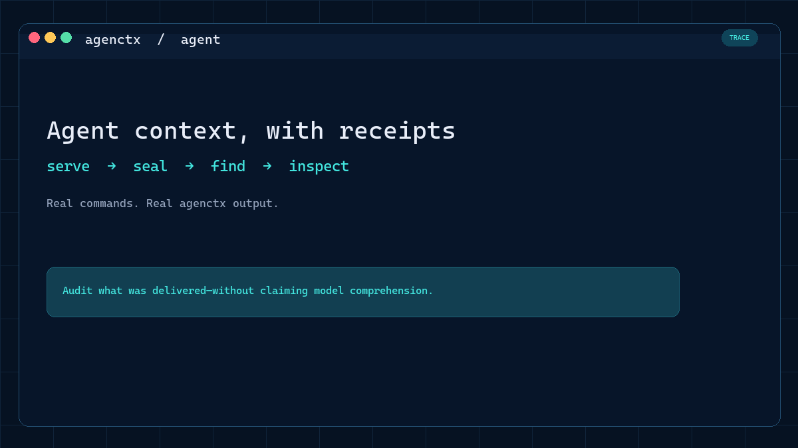

# agenctx


Durable, auditable project context for AI coding agents.

> Originally built on March 12, 2026. The [first scaffold commit](https://github.com/YMuskrat/agentctx/commit/1668fe6b0eb4d2c9a8de785e954e17ef4faa1b7c) and tagged [original prototype snapshot](https://github.com/YMuskrat/agentctx/tree/prototype-2026-03-12) are preserved; public-release work resumed five months later on August 13, 2026.

AI agents repeatedly rediscover the same project rules, decisions, and hazards. `agenctx` keeps that knowledge in a small, version-controlled store inside the repository, with lifecycle management and an audit trail.

It is a dependency-free CLI for Node.js 18 and later.

## Inspect an agent trace

Run `agenctx status` to find recent agent receipt hashes. Then open one with `agenctx session show <hash>` to see every context response agenctx served during that interaction:



The trace shows exactly what agenctx fed to the agent, including whether an entry was previewed or read in full and the order in which it was served.

## Install

From npm, after the first public release:

```sh
npm install --global agenctx
```

Directly from GitHub:

```sh
npm install --global github:YMuskrat/agentctx
```

## Quick start

Run these commands in your project:

```sh
agenctx init
agenctx add warn "Never edit the generated API files"
agenctx add decision "Use SQLite so local development stays self-contained"
agenctx view
agenctx view warnings
agenctx search SQLite
```

`agenctx init` creates `.agenctx/`. Commit that directory so humans and agents share the same project memory.

## See it in action

### 1. Maintain the project context

A maintainer adds knowledge, browses the available context types, updates an existing decision, and pins it for every agent:



### 2. Let an agent use it—and audit the trace

An autonomous agent discovers and reads relevant context. Afterward, a human finds its receipt and verifies exactly what agenctx served in sequence:



## How context is organized

| Banner | What belongs there |
|---|---|
| `warnings` | Landmines and important gotchas |
| `decisions` | Architectural choices and their reasoning |
| `rules` | Coding standards and project conventions |
| `testing` | Test commands and CI requirements |
| `env` | Environment and configuration notes |
| `packages` | Dependency information |
| `notes` | How-tos and general knowledge |
| `refs` | Links and external references |
| `tasks` | Current work |
| `blockers` | Known constraints |

Entries begin as active. Older, rarely read entries decay to ambient and can later be archived. Important entries can be pinned so they remain visible.

CLI screens use the same visual hierarchy throughout: important pinned context first, then populated context types, then empty types. Read state and full reads are labeled explicitly, and each screen ends with a short `Next` section instead of a wall of commands.

`agenctx view` is the project directory: it shows the project description, globally pinned context, and every context type with its purpose, entry count, and open command. `agenctx view warnings` (or any other type) then separates pinned entries from the other active entries.

Repositories can define their own context types without changing the generated agent guides:

```sh
agenctx banner add must-see --description="Mandatory context before making changes"
agenctx add must-see "Authentication tokens must rotate atomically"
```

## Useful commands

```sh
# Add and read context
agenctx add <banner> "message"
agenctx add <banner> --pin "always remember this"
agenctx edit <id> -m "updated context"
agenctx view [banner-or-id]
agenctx feed
agenctx search "keyword" --since=1w

# Manage lifecycle
agenctx pin <id>
agenctx unpin <id>
agenctx archive <id>
agenctx restore <id>
agenctx revert <id>

# Track exactly what agenctx serves during an agent interaction
agenctx --agent start "task description"
agenctx view
agenctx view <type>
agenctx view <id>
agenctx search "keyword" --banner=<type>
agenctx --agent end
agenctx status
agenctx session show <receipt-hash>

# Refresh detected packages, stack, and environment variables
agenctx sync
```

Run `agenctx --help` for the complete command reference.

## Agent instruction files

`agenctx dump` creates three concise agent guides without replacing the rest of their content:

```sh
agenctx dump          # AGENTS.md, CLAUDE.md, and .cursorrules
agenctx dump openai   # AGENTS.md (OpenAI Codex)
agenctx dump claude   # CLAUDE.md
agenctx dump cursor   # .cursorrules
```

These files are deterministic, read-only navigation guides. They never contain repository rules, warnings, custom types, counts, or session data. Agents discover that dynamic information through `agenctx view` and `agenctx search`.

When an agent interaction ends, agenctx writes a content-addressed, hash-chained receipt under `.agenctx/sessions/`. It records each response served in sequence, including entry content hashes, and makes later edits detectable. Use `agenctx status` to list recent receipt hashes and `agenctx session show <hash>` to inspect one.

Use `agenctx dump --check` in CI or install the optional check-only Git hook:

```sh
agenctx init --hook
```

## Project detection

Initialization and sync understand common Node.js, Python, Go, Rust, Java, Ruby, PHP, Docker Compose, and example environment files. Detection is intentionally lightweight and never installs project dependencies.

## Data and privacy

All context is stored locally in `.agenctx/`. The CLI has no telemetry and makes no network requests. Review context before committing it, especially environment descriptions and internal references.

## Development

```sh
npm test
npm pack --dry-run
```

The project deliberately uses no runtime dependencies or build step.

## License

MIT
