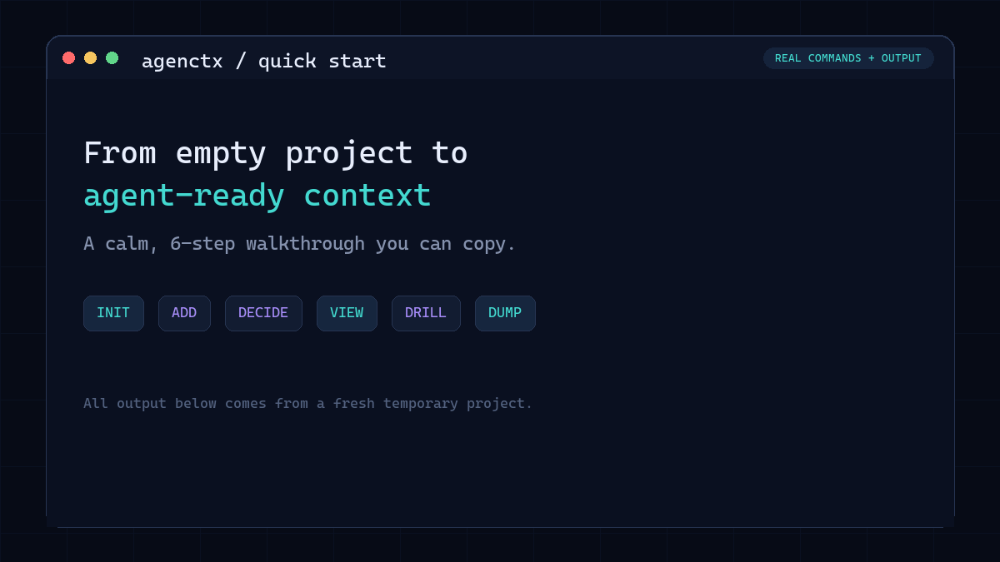

# agenctx


Durable, auditable project context for AI coding agents.

AI agents repeatedly rediscover the same project rules, decisions, and hazards. `agenctx` keeps that knowledge in a small, version-controlled store inside the repository, with lifecycle management and an audit trail.

It is a dependency-free CLI for Node.js 18 and later.

## Install

From npm, after the first public release:

```sh
npm install --global agenctx
```

Directly from GitHub:

```sh
npm install --global github:YMuskrat/agentctx
```

## Quick start

Run these commands in your project:

```sh
agenctx init
agenctx add warn "Never edit the generated API files"
agenctx add decision "Use SQLite so local development stays self-contained"
agenctx view
agenctx view warnings
agenctx search SQLite
```

`agenctx init` creates `.agenctx/`. Commit that directory so humans and agents share the same project memory.

## See it in action

Follow a real project from initialization to agent-ready instructions in six steps:



## How context is organized

| Banner | What belongs there |
|---|---|
| `warnings` | Landmines and important gotchas |
| `decisions` | Architectural choices and their reasoning |
| `rules` | Coding standards and project conventions |
| `testing` | Test commands and CI requirements |
| `env` | Environment and configuration notes |
| `packages` | Dependency information |
| `notes` | How-tos and general knowledge |
| `refs` | Links and external references |
| `tasks` | Current work |
| `blockers` | Known constraints |

Entries begin as active. Older, rarely read entries decay to ambient and can later be archived. Important entries can be pinned so they remain visible.

## Useful commands

```sh
# Add and read context
agenctx add <banner> "message"
agenctx add <banner> --pin "always remember this"
agenctx view [banner-or-id]
agenctx feed
agenctx search "keyword" --since=1w

# Manage lifecycle
agenctx pin <id>
agenctx unpin <id>
agenctx archive <id>
agenctx restore <id>
agenctx revert <id>

# Track agent sessions and reads
agenctx session start "task description"
agenctx view <id> --agent
agenctx session end
agenctx audit

# Refresh detected packages, stack, and environment variables
agenctx sync
```

Run `agenctx --help` for the complete command reference.

## Agent instruction files

`agenctx dump` maintains marked sections in common agent instruction files without replacing the rest of their content:

```sh
agenctx dump agents.md
agenctx dump claude
agenctx dump cursor
agenctx dump all
```

Use `agenctx dump all --check` in CI or install the optional check-only Git hook:

```sh
agenctx init --hook
```

## Project detection

Initialization and sync understand common Node.js, Python, Go, Rust, Java, Ruby, PHP, Docker Compose, and example environment files. Detection is intentionally lightweight and never installs project dependencies.

## Data and privacy

All context is stored locally in `.agenctx/`. The CLI has no telemetry and makes no network requests. Review context before committing it, especially environment descriptions and internal references.

## Development

```sh
npm test
npm pack --dry-run
```

The project deliberately uses no runtime dependencies or build step.

## License

MIT
