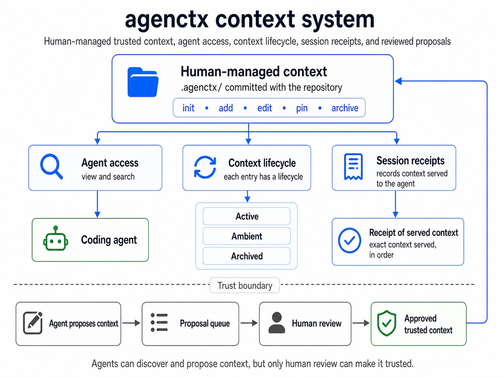
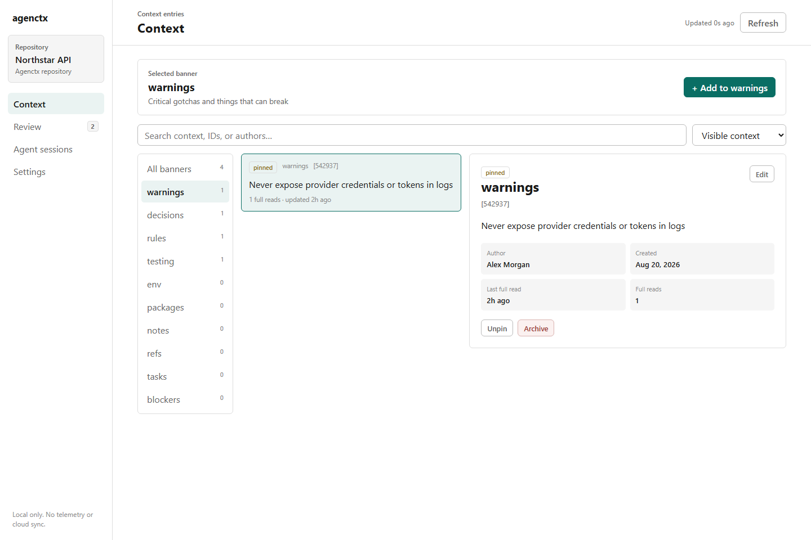

# agenctx


Version-controlled project context for AI coding agents. [agenctx.com](https://agenctx.com)

AI coding agents repeatedly rediscover the same project rules, architectural decisions, test requirements, and hazards. `agenctx` gives a repository one shared context store that humans maintain and agents query when they need it.

Unlike a growing prompt or a long `AGENTS.md`, the context remains structured, searchable, lifecycle-managed, and auditable. Agents retrieve relevant entries on demand, while maintainers can see exactly what was served during each tracked session.

`agenctx` is local-first, dependency-free, and requires Node.js 18 or later. It has no hosted service, telemetry, or runtime dependencies.

## What agenctx does



- **Store project knowledge:** Rules, decisions, warnings, testing requirements, environment notes, and custom context types live in `.agenctx/` and can be reviewed through Git.
- **Switch context channels:** Banners let a human or agent open the domain relevant to the task—such as design, security, testing, or deployment—without loading every project instruction.
- **Serve context on demand:** Generated agent guides teach Codex, Claude, and Cursor how to discover previews and retrieve the complete entry before acting on it.
- **Keep context healthy:** Unread entries move from active to ambient review and then to a retained archive. Reads extend retention; pinned entries do not decay.
- **Control agent learning:** An agent can propose at most two entries per session. Proposals are never trusted or served until a human approves them.
- **Trace delivery:** Tracked sessions produce content-addressed, hash-chained receipts containing the exact ordered context Agenctx served.
- **Work from CLI or UI:** Agents use deterministic commands; humans can browse, edit, review, and inspect sessions in the local control plane.

## Local control plane

Open the repository UI from any directory inside an initialized project:

```sh
agenctx ui
```



The local control plane is the human interface for the same repository data used by the CLI. Its banner list acts as a context switcher: select a channel to browse, search, and add context only within that domain. The UI also provides agent proposal and ambient review queues, complete session traces, decay settings, and preview/full delivery bars. Humans can edit, pin, archive, restore, approve, and reject context without bypassing the repository audit history.

The server binds only to `127.0.0.1`, uses a new launch token for API access, makes no external requests, and refuses stale browser writes when the CLI has changed the same repository data. Use `agenctx ui --no-open` to print the private launch URL without opening a browser, or `agenctx ui --port=4317` to select a local port.

The UI is optional. Agents continue to use the CLI and generated instruction files, so Agenctx also works in terminals, CI, and headless environments.

## Install

From npm:

```sh
npm install --global agenctx
```

Directly from GitHub:

```sh
npm install --global github:YMuskrat/agentctx
```

## Quick start

Run these commands in your project:

```sh
agenctx init
agenctx add warn "Never edit the generated API files"
agenctx add decision "Use SQLite so local development stays self-contained"
agenctx view
agenctx view warnings
agenctx search SQLite
```

`agenctx init` creates `.agenctx/`. Commit that directory so humans and agents share the same project memory.

## See it in action

### 1. Maintain the project context

A maintainer adds knowledge, browses the available context types, updates an existing decision, and pins it for every agent:


### 2. Generate guides for coding agents

`agenctx dump` creates concise static guides for OpenAI Codex, Claude, and Cursor. The guides teach agents how to navigate agenctx; project knowledge remains lifecycle-managed inside `.agenctx/`:


### 3. Audit an agent trace

Run `agenctx status` to list every agent receipt as a hash and task name. Then open one with `agenctx session show <hash>` to see every context response agenctx served during that interaction:


`PREVIEW` and `FULL` distinguish how each entry was delivered, while sequence numbers preserve the serving order. The receipt proves what agenctx served, not whether the model understood or followed it.

## Switchable context channels

A project rarely has one undifferentiated set of instructions. A design task needs interface patterns and accessibility constraints; a security review needs authentication rules and known hazards. Agenctx banners are named context channels that keep those domains separate while preserving one shared repository memory.

Humans switch channels by selecting a banner in the UI. Agents do the same explicitly through `view` and banner-filtered `search`:

```sh
agenctx banner add design --description="UI patterns, design tokens, and accessibility constraints"
agenctx banner add security --description="Authentication, secrets, and threat-model constraints"

agenctx add design "Use the eight-point spacing scale"
agenctx add security "Never include provider credentials in logs"

agenctx view design
agenctx search "credentials" --banner=security
```

An `AGENTS.md` file can contain sections and some tools support directory-specific guides, but it remains a static document. `agenctx dump` keeps that file as a concise navigation guide while the changing project knowledge lives in searchable channels with independent lifecycle and delivery history.

Every repository starts with these built-in channels:

| Banner | What belongs there |
|---|---|
| `warnings` | Landmines and important gotchas |
| `decisions` | Architectural choices and their reasoning |
| `rules` | Coding standards and project conventions |
| `testing` | Test commands and CI requirements |
| `env` | Environment and configuration notes |
| `packages` | Dependency information |
| `notes` | How-tos and general knowledge |
| `refs` | Links and external references |
| `tasks` | Current work |
| `blockers` | Known constraints |

Entries begin as active. A full read refreshes an entry and adds a bounded retention bonus. Inactive entries move to ambient, where they are hidden by default but remain available for review. A full ambient read reactivates the entry; context that remains ambient through the review window moves to the retained archive. Only pinned entries are permanently protected from automatic transitions.

Run `agenctx lifecycle` to see the policy, state counts, ambient review queue, retained archive, upcoming transitions, and recent lifecycle history. Use `agenctx lifecycle --all` to include every active and pinned entry. The default policy keeps unread context active for 30 days, adds 3 days per full read up to a 60-day bonus, and archives context after 60 uninterrupted days in ambient. These values are explicit and configurable under `decay` in `.agenctx/config.json`; every automatic transition is recorded in the audit history.

CLI screens use the same visual hierarchy throughout: important pinned context first, then populated context types, then empty types. Read state and full reads are labeled explicitly; command discovery stays in `agenctx --help` instead of being repeated after every result.

`agenctx view` is the project directory: it shows the project description, globally pinned context, and every context type with its purpose, entry count, and open command. `agenctx view warnings` (or any other type) then separates pinned entries from the other active entries.

Repositories can define their own context types without changing the generated agent guides:

```sh
agenctx banner add must-see --description="Mandatory context before making changes"
agenctx add must-see "Authentication tokens must rotate atomically"
```

## Useful commands

```sh
# Add and read context
agenctx add <banner> "message"
agenctx add <banner> --pin "always remember this"
agenctx edit <id> -m "updated context"
agenctx propose <banner> "durable knowledge discovered by an agent"
agenctx proposals
agenctx approve <proposal-id>
agenctx reject <proposal-id>
agenctx view [banner-or-id]
agenctx feed
agenctx search "keyword" --since=1w

# Manage lifecycle
agenctx lifecycle           # inspect policy, decay, and archive
agenctx lifecycle --all     # include every active and pinned entry
agenctx pin <id>
agenctx unpin <id>
agenctx archive <id>
agenctx restore <id>
agenctx revert <id>
agenctx clear <id>          # remove one entry from live context
agenctx clear <banner>      # empty one context type
agenctx clear all           # empty every context type

# Track exactly what agenctx serves during an agent interaction
agenctx --agent start "task description"
agenctx view --session=<id>
agenctx view <type> --session=<id>
agenctx view <id> --session=<id>
agenctx search "keyword" --banner=<type> --session=<id>
agenctx --agent end --session=<id>
agenctx status
agenctx session show <receipt-hash>

# Refresh detected packages, stack, and environment variables
agenctx sync
```

Run `agenctx --help` for the complete command reference.

## Agent proposals

During a tracked agent session, an agent may propose at most two pieces of durable repository knowledge. Most sessions should propose nothing. Proposals remain separate from project context and are never served to agents until a human approves them:

```sh
agenctx --agent start "fix token rotation"
agenctx propose warning "Token rotation must update both stores atomically" --session=<id>
agenctx --agent end --session=<id>

agenctx proposals
agenctx approve p-a1b2c3
```

Exact duplicates are rejected, reviews are refused while an agent session is active, and the pending review queue is capped at 20 items. Approved and rejected proposals leave the queue; their review remains in the audit history.

## Concurrent agent sessions

Starting a tracked interaction prints a session ID. Pass that ID to later commands so concurrent agents cannot mix their served context:

```sh
agenctx --agent start "fix authentication"
# Session: s-a1b2c3

agenctx view warnings --session=s-a1b2c3
agenctx search tokens --session=s-a1b2c3
agenctx --agent end --session=s-a1b2c3
```

When exactly one session is live, the flag is optional for backward compatibility. When several are live, agenctx refuses to guess. Integrations may set `AGENCTX_SESSION_ID` instead of passing the flag repeatedly. Use `agenctx session list` to see live sessions or `agenctx session abandon <id>` to remove a stale one without sealing a receipt. Live session files are kept under `.agenctx/runtime/`, which agenctx excludes from Git. Existing `.agenctx/session.json` files migrate automatically.

`clear` is intentionally narrower than deleting `.agenctx/`: it removes entries from the live context while preserving banner definitions, audit history, and sealed agent-session receipts. Destructive clears require terminal confirmation; use `--force` only for deliberate non-interactive cleanup.

## Agent instruction files

Already have a long agent instruction file? Preview a deterministic migration into lifecycle-managed context:

```sh
agenctx import AGENTS.md
agenctx import AGENTS.md --apply
```

The importer maps Markdown sections such as Testing, Architecture, Rules, Warnings, and Configuration to the corresponding banners. Entries remain active and unpinned so a maintainer can review what deserves permanent priority. On apply, a root `AGENTS.md`, `CLAUDE.md`, or `.cursorrules` is preserved exactly under `.agenctx/imports/` and replaced with the concise static guide. Use `--keep-source` to import without replacing it.

Unknown level-two sections can become custom banners, but agenctx never invents their purpose. The importer first shows the complete table and marks unresolved custom sections, then asks whether to describe them now. Declining skips all unresolved custom sections; an empty individual purpose skips that section. A Markdown file can provide the purpose explicitly, and nested headings then become entries in that banner:

```md
## Must See
> Purpose: Mandatory context before changing authentication.

### Token rotation
Tokens must rotate atomically.
```

Non-interactive imports skip unknown sections without a `Purpose:` line and report them in the preview. Unknown README sections remain conservative and are skipped unless they explicitly provide a purpose.

README migration is deliberately conservative and explicit:

```sh
agenctx import README.md          # preview operational sections only
agenctx import README.md --apply  # README.md remains unchanged
```

Unrecognized README sections are skipped rather than being turned into context noise. The importer is offline and deterministic; it does not send repository content to a model.

`agenctx dump` creates three concise agent guides without replacing the rest of their content:

```sh
agenctx dump          # AGENTS.md, CLAUDE.md, and .cursorrules
agenctx dump openai   # AGENTS.md (OpenAI Codex)
agenctx dump claude   # CLAUDE.md
agenctx dump cursor   # .cursorrules
```

These files are deterministic, read-only navigation guides. They never contain repository rules, warnings, custom types, counts, or session data. Agents discover that dynamic information through `agenctx view` and `agenctx search`.

When an agent interaction ends, agenctx writes a content-addressed, hash-chained receipt under `.agenctx/sessions/`. It records each response served in sequence, including entry content hashes, and makes later edits detectable. Use `agenctx status` to list receipt hashes with their task names and `agenctx session show <hash>` to inspect the served context grouped by banner.

Use `agenctx dump --check` in CI or install the optional check-only Git hook:

```sh
agenctx init --hook
```

## Project detection

Initialization and sync understand common Node.js, Python, Go, Rust, Java, Ruby, PHP, Docker Compose, and example environment files. Detection is intentionally lightweight and never installs project dependencies.

## Data and privacy

All context is stored locally in `.agenctx/`. The CLI has no telemetry and makes no network requests. Review context before committing it, especially environment descriptions and internal references.

## Development

```sh
npm test
npm pack --dry-run
```

The project deliberately uses no runtime dependencies or build step.

## Project history

Originally built on March 12, 2026. The [first scaffold commit](https://github.com/YMuskrat/agentctx/commit/1668fe6b0eb4d2c9a8de785e954e17ef4faa1b7c) and tagged [original prototype snapshot](https://github.com/YMuskrat/agentctx/tree/prototype-2026-03-12) are preserved; public-release work resumed five months later on August 13, 2026.

## License

MIT
